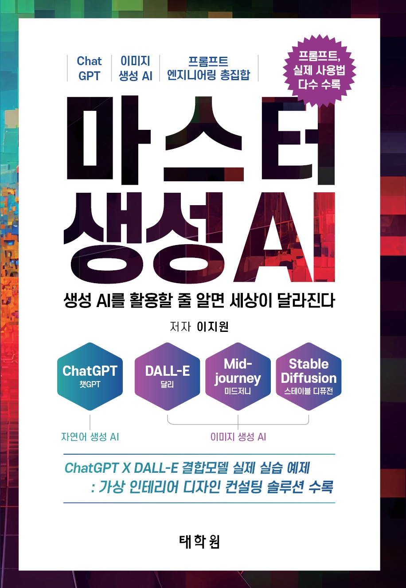

# 마스터 생성 AI - 실습 코드


[](https://product.kyobobook.co.kr/detail/S000202345390)


마스터 생성 AI의 예제 코드 리포지토리에 오신 것을 환영합니다. 이 리포에는 Python을 사용한 AI 모델 생성 및 교육의 다양한 측면을 보여주는 Jupyter 노트북 모음이 포함되어 있습니다.

## 구매
[지금 구매](https://product.kyobobook.co.kr/detail/S000202345390)


## 실습 
[실습 영상 보기](https://promptwith.com/book/master-generative-ai/)


## 시작하기
이 리포를 사용하려면 로컬로 clone해서 사용하면 됩니다. 예제는 ```examples``` 폴더에 있으며 Jupyter 노트북 환경을 또는 [google colab](https://colab.research.google.com/)를 사용하여 실행할 수 있습니다.

## 요구 사항
이 리포지토리에서 예제 노트북을 실행하려면 Jupyter가 설치된 Python 환경이 필요합니다. 또한 일부 예제에는 TensorFlow, Keras 또는 PyTorch와 같은 추가 패키지가 필요할 수 있습니다.

## 기여
이 저장소에 대한 기여를 환영합니다. 버그를 발견하거나 추가 예제에 대한 제안이 있는 경우 문제를 열거나 풀 요청을 제출하십시오.

## 라이선스
이 저장소의 코드는 MIT 라이센스에 따라 제공됩니다.
